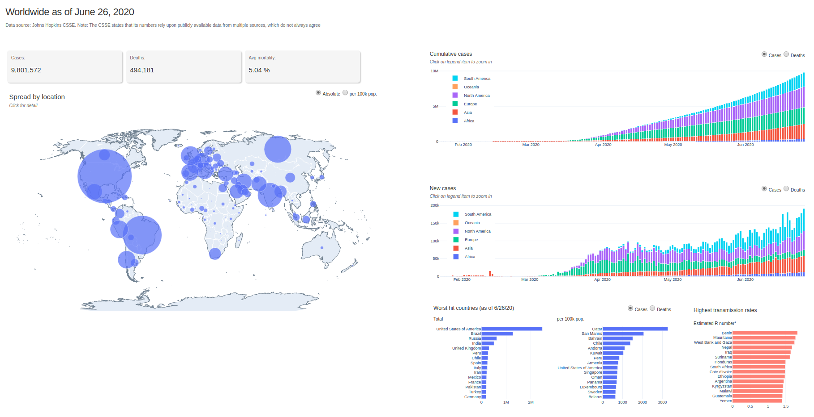

# http://covidbasic111.herokuapp.com/

Interactive dashboard tracking the spread of COVID-19

Open the .ipynb file for detail on the underlying data 

Open the .py file for the code driving the website layout and interactivity

## Screenshots
The following are screenshots for the app in this repo:

!(screenshots/Dash2.png)

!(screenshots/Dash3.png)
